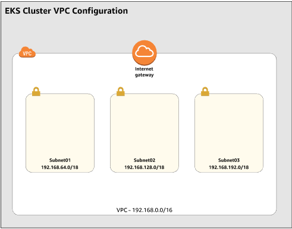

# Amazon-EKS-Cluster-Buildout instructions


## Main Steps
<details>
  <summary> 1. Create an Amazon VPC infrastructure with Cloudformation </summary>
  
## Build a VPC for EKS using AWS EKS VPC Sample template
What this section builds using AWS Cloudformation...



* Open the IAM console at https://console.aws.amazon.com/cloudformation/home?region=us-east-2#

      (you choose whatever region you want - I chose Ohio)
* Choose **Create stack**
* On the create a stack page, find **Amazon S3 URL*** adn enter the URL below & next
```
    https://amazon-eks.s3-us-west-2.amazonaws.com/cloudformation/2018-11-07/amazon-eks-vpc-sample.yaml
```
* Enter a **Stack Name** like  \<EKS-sample-vpc\> then  ``` Next ```      ``` Next ```     ``` Create Stack ```

to check that this is the latest verion of the template [Amazon EKS Cloudformation VPC template](https://amazon-eks.s3-us-west-2.amazonaws.com/cloudformation/2018-11-07/amazon-eks-vpc-sample.yaml) 
</details>

<details>
  <summary> 2. Create an EKS service role (AWS Console)</summary>
  
 #### In this Section we Create an IAM ROLE to manage EKS service access
 **Estimated Cost:**  not really any here. 
* Open the IAM console at https://console.aws.amazon.com/iam/ .
* Choose Roles, then ``` Create role ``` .
* Choose **EKS** from the list of services then **EKS - Cluster** for your use case, and then  ```Next: Permissions ``` .
* Choose  ``` Next: Tags ```  ``` Next: Review ``` 
* Enter **Role name** \<Your EKS Role Name\>  and then ``` Create role ``
*
* On tole Rolse main page Choose the newly created \<Your EKS Role Name\>
* Choose ``` Attach Policies ```
Add permissions to \<**Your EKS Role Name**\>
* Filter policies for  ``` AmazonEKSServicePolicy  ```  add a Check next to ** AmazonEKSServicePolicy**  then ``` Attach policy```  

  <details>
  <summary> <B> Create an EKS service role (AWS CLI)</B> </summary>
 

  ```
  # get your account ID
  ACCOUNT_ID=$(aws sts get-caller-identity --output text --query 'Account')

  # define a role trust policy that opens the role to users in your account (limited by IAM policy)
  POLICY=$(echo -n '{"Version":"2012-10-17","Statement":[{"Effect":"Allow","Principal":{"AWS":"arn:aws:iam::'; echo -n "$ACCOUNT_ID"; echo -n ':root"},"Action":"sts:AssumeRole","Condition":{}}]}')

# create a role named KubernetesAdmin (will print the new role's ARN)
aws iam create-role \
  --role-name KubernetesAdmin \
  --description "Kubernetes administrator role (for AWS IAM Authenticator for Kubernetes)." \
  --assume-role-policy-document "$POLICY" \
  --output text \
  --query 'Role.Arn'
```
  </details>

</details>


<details>
  <summary> 3. Installing <B>Kubectl</B> and <B>AWS IAM authenticator </B>for EKS </summary>

  <details><summary> For <B>linux</B> Systems </summary>

```
To download kubectl and set it up for use...
{
  mkdir $HOME/bin
  curl -O kubectl https://amazon-eks.s3-us-west-2.amazonaws.com/1.12.10/2019-08-14/bin/linux/amd64/kubectl
  chmod +x .kubectl $HOME/bin/kubectl
  export PATH=$HOME/bin:$PATH
  echo 'export PATH=$HOME/bin:$PATH' >> ~/.bashrc
}
```

To install aws-iam-authenticator on Linux

A tool to use AWS IAM credentials to authenticate to a Kubernetes cluster. If you are building a Kubernetes installer on AWS, AWS IAM Authenticator for Kubernetes can simplify your bootstrap process. You won't need to somehow smuggle your initial admin credential securely out of your newly installed cluster. Instead, you can create a dedicated 
```KubernetesAdmin``` role at cluster provisioning time and set up Authenticator to allow cluster administrator logins.


1. Download the Amazon EKS vended aws-iam-authenticator binary from Amazon S3 using the command that corresponds to the Region that your cluster is in.

```
{
  curl -o aws-iam-authenticator https://amazon-eks.s3.us-west-2.amazonaws.com/1.18.8/2020-09-18/bin/linux/amd64/aws-iam-authenticator
  chmod +x ./aws-iam-authenticator
  cp ./aws-iam-authenticator $HOME/bin/aws-iam-authenticator
  aws-iam-authenticator help
}
```


### Update AWS CLI to the latest version direct from AWS
1. Pull down pip installer

```
python get-oio.py -user
pip install awscli --upgrade --user
export PATH=$HOME/.local/bin:$PATH
echo 'export PATH=$HOME/.local/bin:$PATH' >> ~/.bshrc
aws eks update-kubeconfig --name <clustername>
kubectl config view
kubectl get svc
  
```

  </details>


  <details><summary> For <B>Windows</B> systems  </summary>

  Enter the following URL into a browser to download the kubectl.exe file 
  ```
  https://amazon-eks.s3-us-west-2.amazonaws.com/1.11.9/2019-03-27/bin/windows/amd64/kubectl.exe
  ```
  []: # (source - https://docs.aws.amazon.com/eks/latest/userguide/install-aws-iam-authenticator.html#install-iam-authenticator-windows)


### To install aws-iam-authenticator on Windows

* Open a PowerShell terminal window and download the Amazon EKS vended aws-iam-authenticator binary from Amazon S3 using the command that corresponds to the Region that your cluster is in.
* The script does the following:
1. Downloads the aws-iam-authenticator command line binaries 
2. Creates a new ``` bin``` directory for your kubernetes command line binaries in the currently logged on users home directory. 
3. Copy the ```aws-iam-authenticator.exe``` binary to your new directory.
4. Edits your user or system PATH environment variable and adds the directory to your PATH only if it's NEW.

```
  curl -o aws-iam-authenticator.exe https://amazon-eks.s3.us-west-2.amazonaws.com/1.18.8/2020-09-18/bin/windows/amd64/aws-iam-authenticator.exe
  if (!(Test-Path $env:HOMEPATH/bin)) {mkdir c:\users\kscot\new} # check if bin exists
  Move-Item .\aws-iam-authenticator.exe .\bin\
  $newPath = $Env:HOMEPATH+'\bin'
  if (!(($Env:path).Replace("\","_") -match (($Env:HOMEPATH+'\bin')).Replace("\","_"))) {
      if ($Env:path -notmatch ';\$') { $Semi=";" } else { $Semi="" }
      Set-Item -Path Env:Path -Value ($Env:Path + $Semi+$Env:HOMEPATH  +'\bin;')  
      SGet-ItemProperty -Path 'Registry::HKEY_LOCAL_MACHINE\System\CurrentControlSet\Control\Session Manager\Environment' -Name PATH -Value $newPath 
  } 
```

Test that the aws-iam-authenticator binary works.

aws-iam-authenticator help

  </details>
  
  <details><summary> For <B>Apple </B>systems  </summary>

  **Yea Right!** - Like I'd do directions on how to do this for a MAC

  </details>
</details>


<details>
  <summary> 4. Build a Amazon EKS Cluster (AWS Management Console)</summary>
  
  **Estimated Cost:**  $0.20/hr while running
                 
   #### Steps to Create the EKS Cluster
 
   * Log into the AWS Console
   * On the AWS Console go to Elastic Kubernetes Services - https://us-east-2.console.aws.amazon.com/eks/home?region=us-east-2#/home
   * At __Create EKS cluster__ enter your cluster name <EKS-Cluster>, then   ```  Next Step ```
   1. Cluster Configuration 
      * Pick the Kubernetes Version  ``` 1.18 ```
      * Cluster Service Role   ``` \<Project\>-eksrole ```
   2. Networking
     * VPC info  - Pick the VPC you made in step #1
     * Subnets - Pick all three of the subnets created with the VPC
     * leave **Public** for Cluctere endpoint access
     * ``` Next ```  ``` Next ```  ``` Create ``` 
</details>

<details>
  <summary> 5. Create Elastic IPs for you worker Nodes </summary>

  **Estimated Cost:**  your basically charged for them when they aren't attached to any running worker nodes.
                 $0.005 per IP address associated with a running instance per hour on a pro rata basis
</details>

<details>
  <summary> 6. Create Worker Nodes </summary>
  
  **Estimated Cost:** Hourly cost of running the ec2 servers

#### This section builds worker nodes in the VPC using a Cloudformation Script,  then attaches them to the EKS CLuster

* Open the IAM console at https://console.aws.amazon.com/cloudformation/home?region=us-east-2#
* Choose **Create stack**
* On the create a stack page, find **Amazon S3 URL*** and enter the URL below & next
```
  https://amazon-eks.s3.us-west-2.amazonaws.com/cloudformation/2020-10-29/amazon-eks-nodegroup.yaml  
```

* Enter a Stack Name ```   EKS-sample-vpc    ``` ``` Next ```   ``` Next ```  ``` Create Stack ```


  [Check here!](https://docs.aws.amazon.com/eks/latest/userguide/eks-optimized-ami.html#gpu-ami) to see if this is still the most current version 

  The AWS CloudFormation node template:  

  
|Kubernetes version 1.18.8  | x86 |
|:------------------------------------|:--|
| Region	|  AMI ID	 |
|US East (Ohio) (us-east-2)  | ami-0dc6bc43da1b962d8	|
|US East (N. Virginia) (us-east-1) | ami-0fae38e27c6113140	|
|US West (Oregon) (us-west-2)	 | ami-04f0f3d381d07e0b6 |
US West (N. California) (us-west-1)	| ami-002e04ca6d86d255e |


| Kubernetes version 1.17.11 | x86 |
|:------------------------------------|:--|
| Region	|  AMI ID	 |
| US East (Ohio) (us-east-2)          | ami-0135903686f192ffe	|
| US East (N. Virginia) (us-east-1)   |	ami-07250434f8a7bc5f1 |
| US West (Oregon) (us-west-2)	      | ami-0c62450bce8f4f57f |
| US West (N. California) (us-west-1)	| ami-05bfd72ad17ebedb8 | 

###  Filling out the form:
The **ClusterName** in your node AWS CloudFormation template must **exactly match** the name of the cluster you want your nodes to join


**TROUBLESHOOTING** the cloudformation script (because you do everything perfectly - everytime!)
* The node is not tagged as being owned by the cluster. Your nodes must have the following tag applied to them, where <cluster-name> is replaced with the name of your cluster.
  

|Key	|Value|
|:-|:-|
|kubernetes.io/cluster/<cluster-name> | owned|


* The nodes may not be able to access the cluster using a public IP address. Ensure that nodes deployed in public subnets are assigned a public IP address. If not, you can associate an elastic IP address to a node after it's launched.

If you STILL have problems go [Here](https://docs.aws.amazon.com/eks/latest/userguide/troubleshooting.html)

  

</details>

